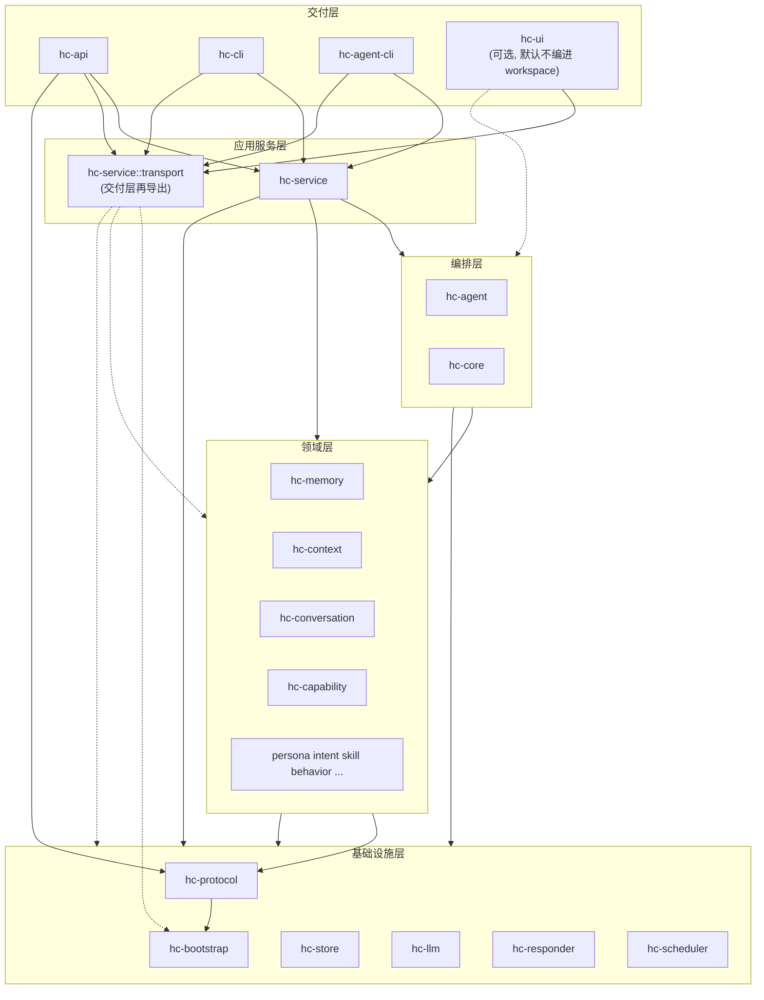

# Honeycomb 架构分层

本文档描述工作区的**目标分层**与**依赖约定**。实现以代码为准：`hc-service::transport` 为交付层跨领域类型的统一入口之一。

## 分层流程图

## 依赖约定

1. **交付层（`apps/*`）**  
   - **HTTP API（`hc-api`）**：业务类型与跨 crate 工具优先从 **`hc_service::transport`** 引用；协议与对外 JSON 契约使用 **`hc-protocol`**。  
   - **终端 CLI（`hc-cli`）**：与编排/上下文/LLM/工具链相关的类型仍直连对应 crate；**bootstrap、behavior、conversation、memory、scheduler、store** 等与 `hc-api` 重叠的跨域符号经 **`hc_service::transport`**（含子模块 **`transport::workspace_markdown_index`**）引用。  
   - **Agent 专用 CLI（`hc-agent-cli`）**：编排仍依赖 **`hc-agent`**；环境、工作区命名空间与 **`WorkspaceStore`** 经 **`hc_service::transport`**（含 **`workspace_markdown_index`**）引用；协议用 **`hc-protocol`**；上下文用 **`hc-context`**。  
   - **可选桌面（`hc-ui`）**：保留在工作区成员中，但**不在**根目录 `default-members` 中；**`workspace_root` / `tenant_id` / `WallClock` 与 `WorkspaceNamespace`** 等与存储相关的跨域符号经 **`hc_service::transport`** 引用；编排仍直连 **`hc-agent`**。需要完整编桌面时使用 `cargo build -p hc-ui`。

2. **应用服务层（`hc-service`）**  
   编排用例、调度、对话、工具等；可依赖编排层与各领域 crate。

3. **编排层（`hc-agent` 等）**  
   任务与 Agent 编排逻辑；**不再**在 crate 根再导出 `hc-capability`、`hc-memory`、`hc-persona`、`hc-responder`、`hc-trace` 的类型——请从对应 crate 引用。

4. **领域层 / 基础设施层**  
   不依赖交付层；不依赖 `hc-api` / `hc-cli` / `hc-agent-cli` / `hc-ui`。

## hc-api 源码目录（与结构对齐）

约定：**按「路由域 / 契约」分子目录**，`run/mod.rs` 负责组装 `Router`、共享状态（`AppState`）与跨域辅助逻辑；具体 handler 逐步迁入与 URL 前缀一致的子模块，避免单文件无限膨胀。

| 路径 | 职责 |
|------|------|
| `apps/hc-api/src/lib.rs` | crate 入口，对外 `pub use` `serve` / `build_router` / `AppState` 等。 |
| `apps/hc-api/src/run/mod.rs` | Axum 路由表、`serve`、`ApiRuntimeConfig`、与各域共用的请求规范化等。 |
| `apps/hc-api/src/run/openapi/` | OpenAPI JSON 与 Swagger UI 壳（HTTP **契约**与文档）。 |
| `apps/hc-api/src/run/memory/` | Memory Room REST（`/v1/memory/...`）及 `room_lookup_request` 等路由辅助。 |
| `apps/hc-api/src/run/behavior/` | `/v1/behavior/*` 列表、详情与决策测试。 |

**建议的后续拆分（与 `build_router` 中的 route 分组一致）**：`run/scheduler/`、`run/conversation/` 等；共享的 `ApiError`、`NamespaceQuery` 等可收拢到 `run/common.rs` 或由 `run/types.rs` 承载（`run/memory/`、`run/behavior/` 已拆）。

## 演进记录

| 项 | 状态 |
|----|------|
| `hc-api` 经 `transport` 收敛对 behavior / memory / store 等的直接依赖 | 已落地 |
| `hc-api` `run/openapi/` 目录承载 OpenAPI + Swagger | 已落地 |
| `hc-api` `run/memory/` 目录承载 Memory Room 路由与 DTO | 已落地 |
| `hc-api` `run/behavior/` 目录承载 `/v1/behavior/*` | 已落地 |
| `hc-ui` 默认不加入 `default-members` | 已落地 |
| `hc-ui` 经 `transport` 收敛 bootstrap / store 直连依赖 | 已落地 |
| `hc-cli` 经 `transport` 收敛 bootstrap / behavior / conversation / memory / scheduler / store | 已落地 |
| `hc-agent-cli` 经 `transport` 收敛 bootstrap / store | 已落地 |
| `hc-agent` 再导出瘦身（移除对 `hc-capability` / `hc-memory` / `hc-persona` / `hc-responder` / `hc-trace` 的根 `pub use`；调用方直连各 crate） | 已落地 |
